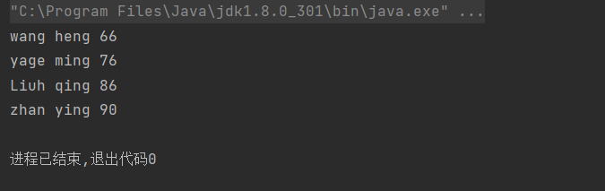
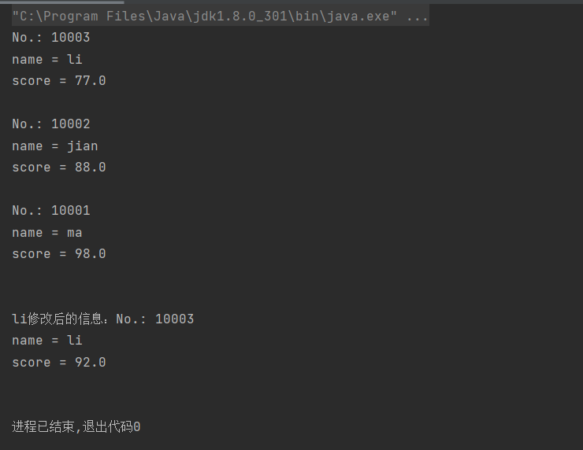
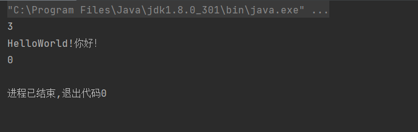
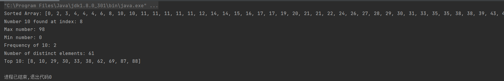
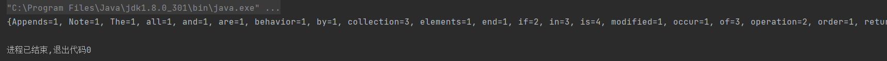

# 实验十 集合使用技术
**任姗骊 计一 320200932080**

## 第一部分
#### 2
+ 解释树结构：由n（n>0）个元素组成的有限集合，有一个节点入度为 0 作为根节点，除根结点外，其余结点被分成m（m>=0）个互不相交的有限集合，而每个子集又都是一棵树（称为原树的子树）
+ `Iterator<Student> te = mytree.iterator();` 的作用：通过 te 遍历 mytree
+ 运行结果：
    
+ 源代码：
```java
import java.util.*;
class treeset {
    public static void main(String[] args) {
        TreeSet<Student>mytree =
                new TreeSet<Student>(new Comparator<Student>() {
                    @Override
                    public int compare(Student a, Student b) {
                        return a.compareTo(b);
                    }
                });
        Student st1, st2, st3, st4;
        st1 = new Student(90, "zhan ying");
        st2 = new Student(66, "wang heng");
        st3 = new Student(86, "Liuh qing");
        st4 = new Student(76, "yage ming");
        mytree.add(st1);
        mytree.add(st2);
        mytree.add(st3);
        mytree.add(st4);
        Iterator<Student> te = mytree.iterator();
        while(te.hasNext()) {
            Student stu = te.next();
            System.out.println("" + stu.name + " " + stu.english);
        }
    }
}

class Student implements Comparator {
    int english = 0;
    String name;
    Student(int e, String n) {
        english = e; name = n;
    }
    public int compareTo(Object b) {
        Student st = (Student) b;
        return (this.english - st.english);
    }

    @Override
    public int compare(Object o1, Object o2) {
        return 0;
    }
}
```
#### 3
+ 哈希存储原理：以关键字Key为自变量，通过一定的函数关系（散列函数或哈希函数），计算出对应的函数值（哈希地址），以这个值作为数据元素的地址，并将数据元素存入到相应地址的存储单元中。
+ Enumeration 接口作用：用来遍历集合中的元素，但是Enumeration只提供了遍历Vector和Hashtable类型集合元素的功能
+ 运行结果：
    
+ 源代码：
```java
import java.util.*;
class Student {
    String name;
    int number;
    float score;
    Student(String name, int number, float score) {
        this.name = name;
        this.number = number;
        this.score = score;
    }

    @Override
    public String toString() {
        return "No.: " + number +
                "\nname = " + name +
                "\nscore = " + score +
                "\n";
    }
}
class HashTableTest {
    public static void main(String[] args) {
        Hashtable h = new Hashtable<>();
        Enumeration e;
        Student stu;
        String str;
        h.put("10001", new Student("ma", 10001, 98));
        h.put("10002", new Student("jian", 10002, 88));
        h.put("10003", new Student("li", 10003, 77));
        e = h.keys();
        while (e.hasMoreElements()) {
            str = (String)e.nextElement();
            System.out.println("" + (Student)h.get(str));
        }
        System.out.println();
        float score = ((Student)h.get("10003")).score;
        h.put("10003", new Student("li", 10003, score + 15));
        System.out.println("li修改后的信息：" + (Student)h.get("10003"));
    }
}
```
## 第二部分
#### 2
+ 运行结果：
  
+ 源代码：
```java
import java.util.*;
public class TestQueue {
    public static void main(String[] args) {
        Queue<String> queue = new LinkedList<String>();
        queue.offer("Hello");
        queue.offer("World!");
        queue.offer("你好！");
        System.out.println(queue.size());
        String str;
        while((str = queue.poll()) != null) {
            System.out.print(str);
        }
        System.out.println();
        System.out.println(queue.size());
    }
}
```
#### 3
+ 运行结果：
    
+ 源代码：
```java
import java.util.*;
public class CollectionAlgorithms {
    public static void main(String[] args) {
        List<Integer> list = new ArrayList<>();
        for(int i = 0; i < 100; i++) {
            list.add((int)(Math.random()*100));
        }
        Collections.sort(list);
        System.out.println("Sorted Array: " + list);
        int testNumber = 10;
        int index = Collections.binarySearch(list, testNumber); // 二分查找，必须先排序再找
        if((index) >= 0) {
            System.out.println("Number " + testNumber + " found at index: " + index);
        } else {
            System.out.println("Number " + testNumber + " not found");
        }
        System.out.println("Max number: " + Collections.max(list));
        System.out.println("Min number: " + Collections.min(list));
        System.out.println("Frequency of " + testNumber + ": " + Collections.frequency(list, testNumber));
        Set<Integer> sortedList = new HashSet<>();
        sortedList.addAll(list);
        System.out.println("Number of distinct elements: " + sortedList.size());
        list.clear();   // remove all items from this list
        list.addAll(sortedList);
        Collections.shuffle(list);      // 打乱集合中的顺序
        List<Integer> topTenList = list.subList(0,10);
        Collections.sort(topTenList);
        System.out.println("Top 10: " + topTenList);
    }
}
```

## 第三部分
#### 使用集合类设计一个统计文本文件中单词频度的程序
+ 运行结果:
    
+ 设计思路: 通过 BufferedReader 读取单词，统计单词不区分大小写。如果第一个字符不是字母，就不统计这个单词。分割单词后，对每个单词判断图中是否有重复单词，无重复，设定频度为 1，有重复，频度加一。
+ 源代码
```java
import java.io.*;
import java.util.*;

public class Freq{
    public static void main(String args[])throws Exception{
        File file = new File("D:\\java\\10\\file.txt");
        display(file);
    }
    public static void display(File file)throws Exception{
        BufferedReader br = new BufferedReader(new FileReader(file));
        String line = null;
        TreeMap<String,Integer> tm = new TreeMap<String,Integer>();
        while((line=br.readLine())!=null){
            line.toLowerCase();
            String reg1 = "\\s+";
            String reg2 ="^[a-zA-Z]\\w*";
            String str[] = line.split(reg1);
            for(String s: str){
                if(s.matches(reg2)){
                    if(!tm.containsKey(s))     // 没有重复
                        tm.put(s,1);
                    else
                        tm.put(s,tm.get(s)+1);
                }
            }
        }
        System.out.println(tm);
    }
}
```