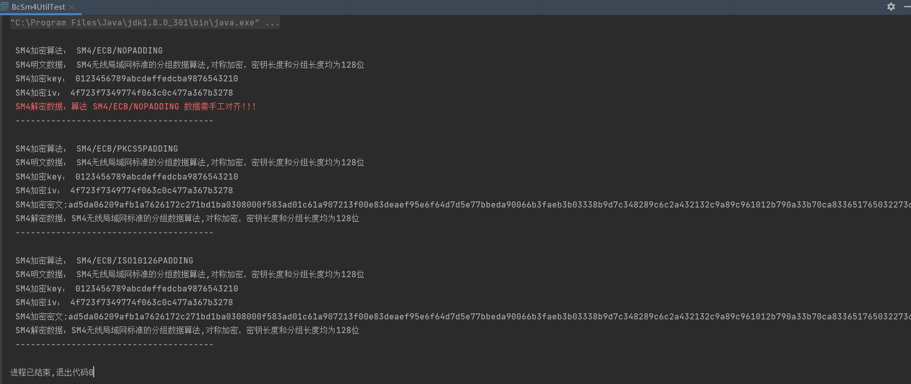
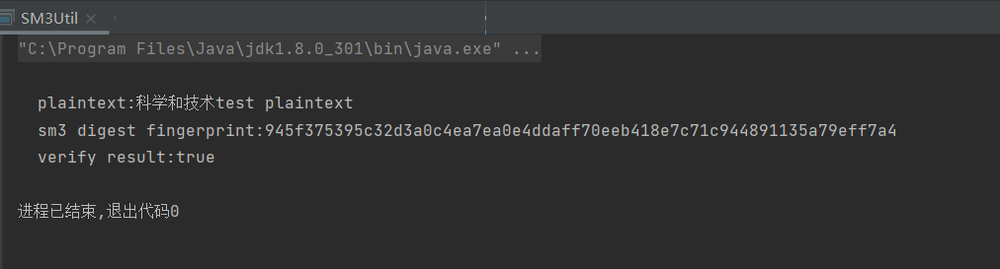
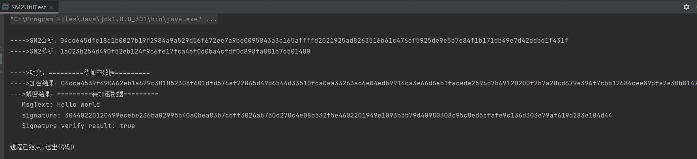

# 实验十一 商用密码算法
**任姗骊 320200932080**

# SM4 算法
+ 运行结果：
  
+ **程序中SM4算法的密钥是怎样生成的？**
    通过密钥扩展算法产生，即将密钥的每个字分别与系统参数的每个字做异或运算得到（K0,K1,K2,K3），再将得到的后3个字与固定参数CK0做异或运算后进行函数T运算得到值C，最后将函数T运算得到的C与K0做异或运算就得到了第一轮的子密钥，也是下一轮密钥运算的K4。
+ **`Cipher.getInstance`、`Cipher.init`、`cipher.doFinal` 方法的功能是什么？**
    `Cipher.getInstance` 传递一个加密算法的名称作为参数，用来创建对应的 Cipher; `Cipher.init`用于初始化 Cipher 对象; `cipher.doFinal` 用于调用数据转换，加密或解密并返回 byte 数组
+ 源代码：
```java
//BcSm4UtilTest.java
import javax.crypto.Cipher;
import javax.crypto.spec.IvParameterSpec;
import javax.crypto.spec.SecretKeySpec;
import javax.crypto.KeyGenerator;
import java.security.SecureRandom;
import java.security.Security;
import org.bouncycastle.util.encoders.Hex;
import org.bouncycastle.jce.provider.BouncyCastleProvider;
import java.security.*;
import javax.crypto.IllegalBlockSizeException;
import java.util.Arrays;
import java.util.*;

class BcSm4Util {
    public static final String ALGORITHM_NAME = "SM4";
    public static final String DEFAULT_KEY = "random_seed";
    // 128-32位16进制；256-64位16进制
    public static final int DEFAULT_KEY_SIZE = 128;
    static {//加载BouncyCastleProvider（简称BC）驱动
        if (Security.getProvider(BouncyCastleProvider.PROVIDER_NAME) == null)
            Security.addProvider(new BouncyCastleProvider());
    }
    //生成默认密钥
    public static byte[] generateKey() throws NoSuchAlgorithmException, NoSuchProviderException {
        return generateKey(DEFAULT_KEY, DEFAULT_KEY_SIZE);
    }
    //用种子seed生成密钥
    public static byte[] generateKey(String seed) throws NoSuchAlgorithmException, NoSuchProviderException {
        return generateKey(seed, DEFAULT_KEY_SIZE);
    }
    //用种子seed生成指定长度keySize的密钥
    public static byte[] generateKey(String seed, int keySize) throws NoSuchAlgorithmException, NoSuchProviderException {
        //返回有BC生成的指定算法的密钥对象
        KeyGenerator kg = KeyGenerator.getInstance(ALGORITHM_NAME, BouncyCastleProvider.PROVIDER_NAME);
        SecureRandom random = SecureRandom.getInstance("SHA1PRNG");//SecureRandom生成伪随机数对象
        if (null != seed && !"".equals(seed)) {
            random.setSeed(seed.getBytes());//设置密钥种子
        }

        kg.init(keySize, random);//用密钥种子随机数初始化生成keySize位密钥
        return kg.generateKey().getEncoded();//返回密钥
    }

    /*
     * Sm4加密方法，调用Sm4core的加解密算法
     * @param algorithmName 使用的算法/模式/dPadding模式，如SM4/ECB/NoPadding
     * @param key 密钥
     * @param iv 初始向量(ECB模式下载NULL，CBC模式时作为偏移量)
     * @param data 明文数据
     * @return 返回加密后的密文数据
     * @throws Exception
     */
    public static byte[] encrypt(String algorithmName, byte[] key, byte[] iv, byte[] data) throws Exception {
        return sm4core(algorithmName,Cipher.ENCRYPT_MODE, key, iv, data);
    }
    /*
     * Sm4解密方法，调用Sm4core的加解密方法
     * @param algorithmName 使用的算法/模式/dPadding模式，如SM4/ECB/NoPadding
     * @param key 密钥
     * @param iv 初始向量(ECB模式下载NULL，CBC模式时作为偏移量)
     * @param data 密文数据
     * @return 返回解密后的明文数据
     * @throws Exception
     */
    public static byte[] decrypt(String algorithmName, byte[] key, byte[] iv, byte[] data) throws Exception {
        return sm4core(algorithmName, Cipher.DECRYPT_MODE, key, iv, data);
    }
    /*
     * Sm4加解密方法
     * @param data 加解密数据
     * @param key 密钥
     * @param algorithmName 使用的算法/模式/dPadding模式，如SM4/ECB/NoPadding
     * @param iv 初始向量(ECB模式下载NULL，CBC模式时作为偏移量)
     * @param mode 加密或解密模式，Cipher.ENCRYPT_MODE，Cipher.DECRYPT_MODE分别为加密、解密模式
     * @return 加密模式时返回密文，解密模式时返回明文
     * @throws Exception
     */
    private static byte[] sm4core(String algorithmName, int mode, byte[] key, byte[] iv, byte[] data) throws Exception {
        //生成指定算法模式的Cipher对象，Cipher 完成加解密工作
        Cipher cipher = Cipher.getInstance(algorithmName, BouncyCastleProvider.PROVIDER_NAME);
        Key sm4Key = new SecretKeySpec(key, ALGORITHM_NAME);
        //cipher.init 初始化cipher对象，根据mode方式确定加密或解密操作
        if (algorithmName.contains("/ECB/")) {//ECB模式时不需要iv初始向量
            cipher.init(mode, sm4Key);
        } else {//用算法参数mode、密钥sm4Key和随机数据源ivParameterSpec初始化
            IvParameterSpec ivParameterSpec = new IvParameterSpec(iv);
            cipher.init(mode, sm4Key, ivParameterSpec);
        }
        //对数据data加密或解密（mode为Cipher.ENCRYPT_MODE时加密，为Cipher.DECRYPT_MODE时解密）。
        return cipher.doFinal(data);
    }
}

public class BcSm4UtilTest {

    public static void main(String[] args) throws NoSuchProviderException, NoSuchAlgorithmException {
        String text = "SM4无线局域网标准的分组数据算法,对称加密，密钥长度和分组长度均为128位";
        //String text = "0123456789ABCDEFFEDCBA9876543210";//十六进制字符串
        //String text = "中23456789ABCDEF0123456789ABCDEF";
        String keyHex = "0123456789ABCDEFFEDCBA9876543210";
        //byte[] key = BcSm4Util.generateKey();
        byte[] key = Hex.decode(keyHex);
        String ivHex = "4F723F7349774F063C0C477A367B3278";
        byte[] iv = null;

        List<String> algorithm = new ArrayList<>();
		/*
		algorithm.add(("SM4/CBC/NOPADDING"));
        algorithm.add(("SM4/CBC/PKCS5PADDING"));
        algorithm.add(("SM4/CBC/ISO10126PADDING"));
		algorithm.add(("SM4/PCBC/NOPADDING"));
        algorithm.add(("SM4/PCBC/PKCS5PADDING"));
        algorithm.add(("SM4/PCBC/ISO10126PADDING"));
        algorithm.add(("SM4/CTR/NOPADDING"));
        algorithm.add(("SM4/CTR/PKCS5PADDING"));
        algorithm.add(("SM4/CTR/ISO10126PADDING"));
        algorithm.add(("SM4/CTS/NOPADDING"));
        algorithm.add(("SM4/CTS/PKCS5PADDING"));
        algorithm.add(("SM4/CTS/ISO10126PADDING"));
		*/
        algorithm.add(("SM4/ECB/NOPADDING"));
        algorithm.add(("SM4/ECB/PKCS5PADDING"));
        algorithm.add(("SM4/ECB/ISO10126PADDING"));

        if (iv == null)
            iv = Hex.decode(ivHex);
        for (String s : algorithm) {
            //SM4加密
            try {
                System.out.println("\n SM4加密算法： " + s);
                System.out.println(" SM4明文数据： " + text);
                System.out.println(" SM4加密key： " + Hex.toHexString(key));
                System.out.println(" SM4加密iv： " + Hex.toHexString(iv));
                byte[] encrypt = BcSm4Util.encrypt(s, key, iv, text.getBytes("utf-8"));
                System.out.println(" SM4加密密文:"+Hex.toHexString(encrypt));
                //SM4解密
                byte[] decrypt = BcSm4Util.decrypt(s, key, iv, encrypt);
                System.out.println(" SM4解密数据："+new String(decrypt,"utf-8"));
            } catch (Exception e) {
                if (e instanceof IllegalBlockSizeException) {
                    System.err.println(" SM4解密数据：算法 "+ s +" 数据需手工对齐!!!");
                } else {
                    System.err.println(" SM4解密数据：算法" + s+"::"+ e.getMessage());
                }
            } finally {
                System.out.println(" ---------------------------------------");
            }
        }
    }
}
```

# SM3 算法
+ 运行结果：
    
+ **SM3 算法形成的信息摘要是多少位二进制？**
    SM3算法对于长度小于264位的消息，产生一个256位的消息摘要。
+ **修改 main 方法中 plaintext 字符串中一个字符，对比两个字符串的信息摘要是否相同？**
  不相同
+ **程序中SM3Digest类的update、doFinal方法的功能是什么？**
  Update 用于更新要由字节签名或验证的数据。，doFinal 用于产生数字签名并存于 byte 数组
+ 源代码：
```java
import org.bouncycastle.jce.provider.BouncyCastleProvider;
import org.bouncycastle.crypto.digests.SM3Digest;
import org.bouncycastle.util.encoders.Hex;
import java.security.Security;
import java.util.Arrays;
public class SM3Util {
    static{
        if (Security.getProvider(BouncyCastleProvider.PROVIDER_NAME) == null)
            Security.addProvider(new BouncyCastleProvider());
    }
    //采用SM3算法默认密钥生成摘要，作为返回值
    public static byte[] digest(byte[] input){
        //生成一个sm3算法的对象
        SM3Digest sm3Digest = new SM3Digest();
        //按照指定的字节来更新摘要
        sm3Digest.update(input, 0, input.length);
        byte[] ret = new byte[sm3Digest.getDigestSize()];
        //产生信息摘要ret
        sm3Digest.doFinal(ret, 0);
        return ret;
    }
    /**
     * 计算源数据srcData的信息摘要与提供的信息摘要digestbytes是否一致
     * @param srcData     明文字节数组
     * @param digestbytes 手工提供的摘要字节数组（16进制数组）
     * @return 验证结果
     * @explain 验证明文生成的hash数组与手工给出的摘要数组是否相同
     */
    public static boolean verify(byte[] srcData, byte[] digestbytes) {
        boolean flag = false;
        byte[] newHash = digest(srcData);
        if (Arrays.equals(newHash, digestbytes))
            flag = true;
        return flag;
    }

    public static void main(String[] args) throws Exception {
        String plaintext = "科学和技术test plaintext";
        String oldfingerprint = "945f375395c32d3a0c4ea7ea0e4ddaff70eeb418e7c71c944891135a79eff7a4";
        boolean flag = false;
        byte[] plainbytes = plaintext.getBytes("utf-8");
        byte[] newfingerprint = digest(plainbytes);
        System.out.println("\n  plaintext:"+plaintext);
        System.out.println("  sm3 digest fingerprint:" + Hex.toHexString(newfingerprint));
        flag=verify( plainbytes,  Hex.decode(oldfingerprint));
        System.out.println("  verify result:"+flag);
    }
}
```

# SM2 算法
+ 运行结果
    
+ **程序中SM2算法的密钥对是如何生成的**
    采用在椭圆曲线上的特定点进行特殊的乘法运算来实现的
+ **SM2Engine 类的 init、processBlock 方法的功能是什么？**
    init 初始化引擎; processBlock 处理块，包括加密和解密
+ **Signature 类的 getInstance、initSign、update、initVerify、verify 方法的功能是什么？**
    getInstance() 用于返回实现指定签名算法的Signature 对象; initSign() 用于如果使用其他参数再次调用此方法，此调用的结果将无效; initSign() 用于初始化这个用于签名的对象; update() 用于更新要由字节签名或验证的数据;verify() 用于验证传入的签名。
+ 源代码；
```java
// SM2UtilTest.java
import org.bouncycastle.asn1.gm.GMNamedCurves;
import org.bouncycastle.asn1.x9.X9ECParameters;
import org.bouncycastle.crypto.InvalidCipherTextException;
import org.bouncycastle.crypto.engines.SM2Engine;
import org.bouncycastle.crypto.params.*;
import org.bouncycastle.jcajce.provider.asymmetric.ec.BCECPrivateKey;
import org.bouncycastle.jcajce.provider.asymmetric.ec.BCECPublicKey;
import org.bouncycastle.jcajce.spec.SM2ParameterSpec;
import org.bouncycastle.jce.provider.BouncyCastleProvider;
import org.bouncycastle.jce.spec.ECParameterSpec;
import org.bouncycastle.jce.spec.ECPrivateKeySpec;
import org.bouncycastle.jce.spec.ECPublicKeySpec;
import org.bouncycastle.util.encoders.Hex;
import javax.crypto.Cipher;
import javax.crypto.spec.SecretKeySpec;
import java.security.Signature;
import java.security.*;
import java.security.spec.ECGenParameterSpec;
import java.security.cert.CertPathBuilderException;
import java.security.cert.CertificateException;
import java.security.cert.X509Certificate;
import java.util.Arrays;
import java.util.Enumeration;
import java.math.BigInteger;
import java.io.*;
enum Mode  {
    C1C2C3, C1C3C2;//两种加密标准，前者为旧标准，后者为新标准
}
//BouncyCastle 1.68版本进行测试，1.57以前不支持新标准
public class SM2UtilTest {
    static {  //加载BC驱动
        if (Security.getProvider(BouncyCastleProvider.PROVIDER_NAME) == null)
            new BouncyCastleProvider();
    }

    // 生成sm2密钥对
    static KeyPair createECKeyPair() {
        //使用标准名称创建EC参数生成的参数规范
        final ECGenParameterSpec sm2Spec = new ECGenParameterSpec("sm2p256v1");

        // 获取一个椭圆曲线类型的密钥对生成器
        final KeyPairGenerator kpg;
        try {
            kpg = KeyPairGenerator.getInstance("EC", new BouncyCastleProvider());
// 使用SM2算法域参数集初始化密钥生成器（默认使用最高优先级安装的提供者的 SecureRandom 的实现作为随机源）
            // kpg.initialize(sm2Spec);
            // 使用SM2的算法域参数集和指定的随机源初始化密钥生成器
            kpg.initialize(sm2Spec, new SecureRandom());
            // 通过密钥生成器生成密钥对
            return kpg.generateKeyPair();

        } catch (Exception e) {
            e.printStackTrace();
            return null;
        }
    }

    /*
     *公钥加密
     * @param publicKey SM2公钥
     * @param data      明文数据
     * @param modeType  加密模式
     * @return          密文数据
     */
    public static byte[] encrypt(BCECPublicKey publicKey, byte[] inputBytes, int modeType){
        //加密模式
        SM2Engine.Mode mode;
        if (modeType == 1) {//采用新模式加密标准
            mode = SM2Engine.Mode.C1C3C2;
        } else {//采用旧模式加密标准
            mode = SM2Engine.Mode.C1C2C3;
        }
        //通过公钥对象获取公钥的基本域参数。
        ECParameterSpec ecParameterSpec = publicKey.getParameters();
        ECDomainParameters ecDomainParameters = new ECDomainParameters(ecParameterSpec.getCurve(),
                ecParameterSpec.getG(), ecParameterSpec.getN());
        //通过公钥值和公钥基本参数创建公钥参数对象
        ECPublicKeyParameters ecPublicKeyParameters = new ECPublicKeyParameters(publicKey.getQ(), ecDomainParameters);
        //根据加密模式实例化SM2公钥加密引擎
        SM2Engine sm2Engine = new SM2Engine(mode);
        //初始化加密引擎
        sm2Engine.init(true, new ParametersWithRandom(ecPublicKeyParameters, new SecureRandom()));

        byte[] arrayOfBytes = null;
        try {
            //通过加密引擎对字节数串行加密
            arrayOfBytes = sm2Engine.processBlock(inputBytes, 0, inputBytes.length);
        } catch (Exception e) {
            System.out.println("SM2加密时出现异常:" + e.getMessage());
            e.printStackTrace();
        }
        return arrayOfBytes;
    }
    /**
     * 私钥解密
     *
     * @param privateKey  SM私钥
     * @param cipherBytes 密文数据
     * @param modeType 加密模式
     * @return           解密后的明文
     */
    public static byte[] decrypt(BCECPrivateKey privateKey, byte[] cipherBytes, int modeType) {
        //解密模式
        SM2Engine.Mode mode;
        if (modeType == 1) {
            mode = SM2Engine.Mode.C1C3C2;
        } else {
            mode = SM2Engine.Mode.C1C2C3;
        }

        //通过私钥对象获取私钥的基本域参数。
        ECParameterSpec ecParameterSpec = privateKey.getParameters();
        ECDomainParameters ecDomainParameters = new ECDomainParameters(ecParameterSpec.getCurve(),
                ecParameterSpec.getG(), ecParameterSpec.getN());

        //通过私钥值和私钥基本参数创建私钥参数对象
        ECPrivateKeyParameters ecPrivateKeyParameters = new ECPrivateKeyParameters(privateKey.getD(),
                ecDomainParameters);

        //通过解密模式创建解密引擎并初始化
        SM2Engine sm2Engine = new SM2Engine(SM2Engine.Mode.C1C3C2);
        sm2Engine.init(false, ecPrivateKeyParameters);

        byte[] arrayOfBytes = null;
        try {
            //通过解密引擎对密文字节串进行解密
            arrayOfBytes = sm2Engine.processBlock(cipherBytes, 0, cipherBytes.length);
        } catch (Exception e) {
            System.out.println("SM2解密时出现异常" + e.getMessage());
        }
        return arrayOfBytes;
    }


    //椭圆曲线ECParameters ASN.1 结构
    private static X9ECParameters x9ECParameters = GMNamedCurves.getByName("sm2p256v1");
    //椭圆曲线公钥或私钥的基本域参数。
    private static ECParameterSpec ecDomainParameters = new ECParameterSpec(x9ECParameters.getCurve(), x9ECParameters.getG(), x9ECParameters.getN());

    /**
     * 公钥字符串转换为 BCECPublicKey 公钥对象
     *
     * @param pubKeyHex 64字节十六进制公钥字符串(如果公钥字符串为65字节首字节为0x04：表示该公钥为非压缩格式，操作时需要删除)
     * @return BCECPublicKey SM2公钥对象
     */

    public static BCECPublicKey getECPublicKeyByPublicKeyHex(String pubKeyHex) {
        //截取64字节有效的SM2公钥（如果公钥首字节为0x04）
        if (pubKeyHex.length() > 128) {
            pubKeyHex = pubKeyHex.substring(pubKeyHex.length() - 128);
        }
        //将公钥拆分为x,y分量（各32字节）
        String stringX = pubKeyHex.substring(0, 64);
        String stringY = pubKeyHex.substring(stringX.length());
        //将公钥x、y分量转换为BigInteger类型
        BigInteger x = new BigInteger(stringX, 16);
        BigInteger y = new BigInteger(stringY, 16);
        //通过公钥x、y分量创建椭圆曲线公钥规范
        ECPublicKeySpec ecPublicKeySpec = new ECPublicKeySpec(x9ECParameters.getCurve().createPoint(x, y), ecDomainParameters);
        //通过椭圆曲线公钥规范，创建出椭圆曲线公钥对象（可用于SM2加密及验签）
        return new BCECPublicKey("EC", ecPublicKeySpec, BouncyCastleProvider.CONFIGURATION);
    }

    /**
     * 私钥字符串转换为 BCECPrivateKey 私钥对象
     *
     * @param privateKeyHex: 32字节十六进制私钥字符串
     * @return BCECPrivateKey:SM2私钥对象
     */
    public static BCECPrivateKey getBCECPrivateKeyByPrivateKeyHex(String privateKeyHex) {
        //将十六进制私钥字符串转换为BigInteger对象
        BigInteger d = new BigInteger(privateKeyHex, 16);
        //通过私钥和私钥域参数集创建椭圆曲线私钥规范
        ECPrivateKeySpec ecPrivateKeySpec = new ECPrivateKeySpec(d, ecDomainParameters);
        //通过椭圆曲线私钥规范，创建出椭圆曲线私钥对象（可用于SM2解密和签名）
        return new BCECPrivateKey("EC", ecPrivateKeySpec, BouncyCastleProvider.CONFIGURATION);
    }

    /**
     * 明文签证
     *
     * @param msg: 32字节十六进制明文数组
     * @param privateKey:SM2私钥对象
     * @return 十六进制字符数组签名
     */
    public static byte[] Sm2Sign(byte[] msg,PrivateKey privateKey)throws IOException, NoSuchAlgorithmException, NoSuchProviderException, InvalidAlgorithmParameterException,
            InvalidKeyException,CertPathBuilderException, SignatureException, CertificateException{
        // 生成SM2sign with sm3 签名验签算法实例
        Signature signature = Signature.getInstance("SM3withSm2", new BouncyCastleProvider());
        // 签名 签名需要使用私钥初始化签名实例
        signature.initSign(privateKey);
        // 签名原文
        signature.update(msg);
        // 计算签名值，作为返回值
        byte[] signatureValue = signature.sign();
        return signatureValue;
    }

    /**
     * 签名验证
     *
     * @param msg: 十六进制明文字符数组
     * @param fingerprint: 提供的十六进制字节数组签名
     * @param publicKey:SM2公钥对象
     * @return 签名是否正确
     */
    public static boolean Sm2Verify(byte[] msg,byte[] fingerprint,PublicKey publicKey)throws IOException,
            NoSuchAlgorithmException,CertPathBuilderException, NoSuchProviderException, InvalidAlgorithmParameterException,
            InvalidKeyException, SignatureException{
        // 生成SM2sign with sm3 签名验签算法实例
        Signature signature = Signature.getInstance("SM3withSm2", new BouncyCastleProvider());
        //验签 签名需要使用公钥初始化签名实例
        signature.initVerify(publicKey);
        // 写入待验签的签名原文
        signature.update(msg);
        // 验签
        return signature.verify(fingerprint);

    }

    public static void main(String[] args) throws IOException, NoSuchAlgorithmException, NoSuchProviderException,
            InvalidAlgorithmParameterException, CertPathBuilderException,InvalidKeyException, SignatureException, CertificateException{

        String publicKeyHex = null;
        String privateKeyHex = null;
        //产生公钥、私钥密钥对
        KeyPair keyPair = createECKeyPair();
        PrivateKey privateKey = keyPair.getPrivate();
        PublicKey publicKey = keyPair.getPublic();
        System.out.println();
        if (publicKey instanceof BCECPublicKey){
            //获取65字节非压缩的十六进制公钥串(0x04)
            byte[] publicKeyBytes = ((BCECPublicKey) publicKey).getQ().getEncoded(false);
            publicKeyHex = Hex.toHexString(publicKeyBytes);
            System.out.println("---->SM2公钥：" + publicKeyHex);
        }

        if (privateKey instanceof BCECPrivateKey) {
            //获取32字节十六进制私钥串
            privateKeyHex = ((BCECPrivateKey) privateKey).getD().toString(16);
            System.out.println("---->SM2私钥：" + privateKeyHex);
        }

        // 公钥加密
        String plainText = "=========待加密数据=========";
        byte[] plainBytes = plainText.getBytes("utf-8");
        System.out.println("\n---->明文：" + plainText);
        //将十六进制公钥串转换为 BCECPublicKey 公钥对象
        BCECPublicKey bcecPublicKey = getECPublicKeyByPublicKeyHex(publicKeyHex);
        byte[] encryptBytes = encrypt(bcecPublicKey, plainBytes, 1);
        String encryptData = Hex.toHexString(encryptBytes);
        System.out.println("---->加密结果：" + encryptData);

        // 私钥解密
        //将十六进制私钥串转换为 BCECPrivateKey 私钥对象
        BCECPrivateKey bcecPrivateKey = getBCECPrivateKeyByPrivateKeyHex(privateKeyHex);
        byte[] decryBytes = decrypt(bcecPrivateKey, encryptBytes, 1);
//将解密后的字节串转换为utf8字符编码的字符串（需要与明文加密时字符串转换成字节串所指定的字符编码保持一致）
        String data = new String(decryBytes,"utf-8");
        System.out.println("--->解密结果：" + data);

        //签名与验证
        String msgText =  "Hello world";
        byte[] msgBytes = msgText.getBytes("UTF-8");
        byte[] signatureValue = Sm2Sign(msgBytes,privateKey);
        System.out.println("   MsgText: " + msgText);
        System.out.println("   signature: " + Hex.toHexString(signatureValue));
        System.out.println("   Signature verify result: " + Sm2Verify(msgBytes,signatureValue,publicKey));
    }
}
```