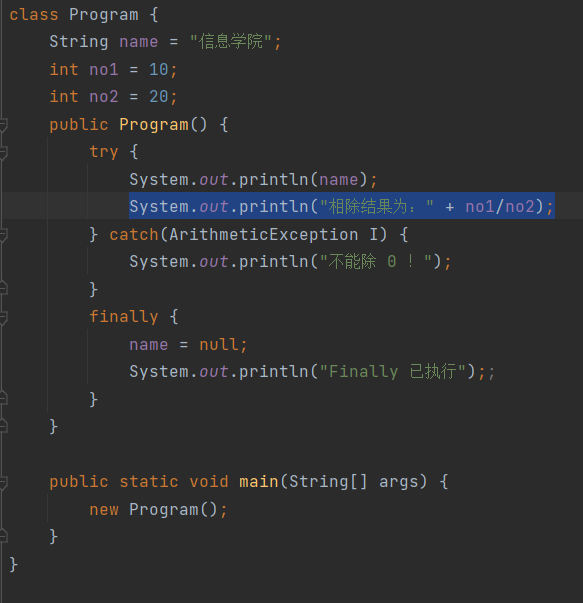
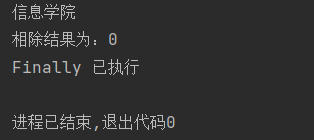
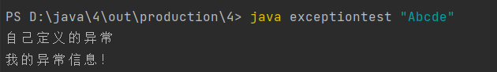
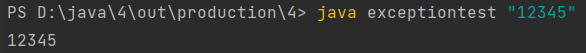
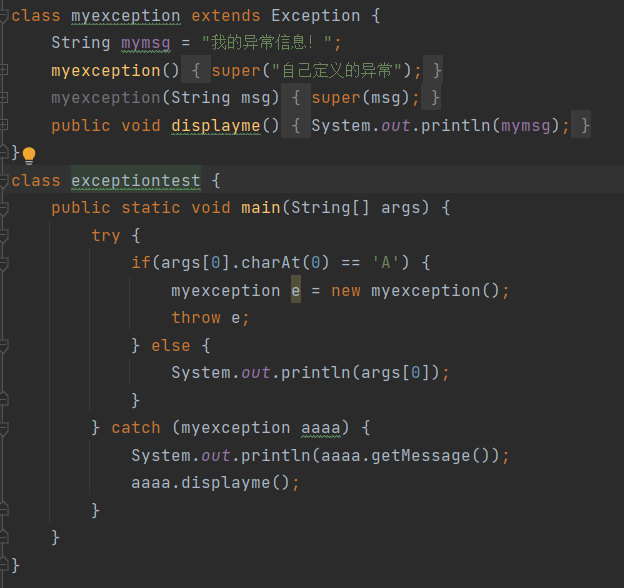
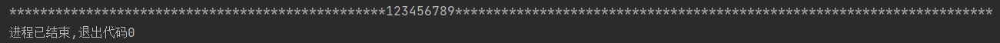
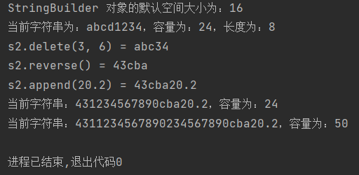
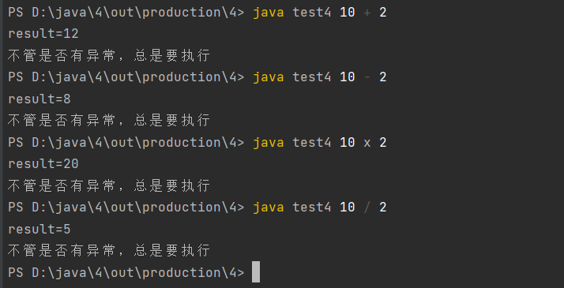

# 实验报告四 异常处理和部分常用类测试
**任姗骊 320200932080**

## 第一部分
#### 2
+ **finally 关键字的作用** : 无论程序是否有异常出现，都要执行 finally 块内的内容，可以维护对象的内部状态，和清理非内存资源。
+ **引发异常的语句为** : `System.out.println("相除结果为：" + no1/no2);`
+ **源代码和运行结果**


#### 3
+ **用 `java exceptiontest "Abcde"` 执行后的输出结果** : 
+ **用 `java exceptiontetst "12345"` 执行后的输出结果** : 
+ **源代码** : 

## 第二部分
#### 1
+ **源代码和运行结果**
```java
class NoLowerLetter extends Exception {   // 定义异常类
    public void print() {
        System.out.printf("%c", '#');
    }
}
class NoDigit extends Throwable {    // 声明异常类
    public void print() {
        System.out.printf("%c", '*');
    }
}
class Test {
    void printLetter(char c) throws NoLowerLetter {
        if(c < 'a' || c > 'z') {
            NoLowerLetter noLowerLetter = new NoLowerLetter();  // 创建对象
            throw noLowerLetter;    // 抛出
        } else {
            System.out.print(c);
        }
    }

    void printDigit(char c) throws NoDigit {
        if(c < '1' || c > '9') {
            NoDigit noDigit = new NoDigit();    // 创建对象
            throw noDigit;    // 抛出
        } else {
            System.out.print(c);
        }
    }
}
public class ExceptionExample {
    public static void main(String[] args) {
        Test t = new Test();
        for(int i = 0; i < 128; i++) {
            try {
                t.printDigit((char)i);
            } catch (NoDigit e) {
                e.print();
            }
        }
    }
}
```

#### 3
+ **源代码和运行结果**
```java
public class shiyan6_2_3 {
    public static void main(String[] args) {
        StringBuilder s1 = new StringBuilder();
        System.out.println("StringBuilder 对象的默认空间大小为：" + s1.capacity());
        StringBuilder s2 = new StringBuilder("abcd1234");
        System.out.println("当前字符串为：" + s2.toString() + "，容量为：" + s2.capacity() + "，长度为：" + s2.length());
        System.out.println("s2.delete(3, 6) = " + s2.delete(3, 6).toString());
        System.out.println("s2.reverse() = " +s2.reverse().toString());
        System.out.println("s2.append(20.2) = " + s2.append(20.2).toString());
        s2 = s2.insert(2, "1234567890");
        System.out.println("当前字符串：" + s2.toString() + "，容量为：" + s2.capacity());
        s2 = s2.insert(3, "1234567890");
        System.out.println("当前字符串：" + s2.toString() + "，容量为：" + s2.capacity());
    }
}
```


## 第三部分
+ 运行结果：
    
+ 设计思路：通过 main 函数传参，通过 switch-case 判断运算符号，除数为 0 的其余异常通过 catch 处理，除数为 0 的异常通过 while 循环处理。
+ 源代码：
```java
import java.util.Scanner;

class Calculator {
    public static void main(String[] args) {
        int x, y, result = 0;
        char op;
        try {
            x = Integer.parseInt(args[0]);
            y = Integer.parseInt(args[2]);
            op = args[1].charAt(0);
            switch (op) {
                case '+':
                    result = x + y;
                    System.out.println("result = " + result);
                    break;
                case '-':
                    result = x - y;
                    System.out.println("result = " + result);
                    break;
                case 'x':
                    result = x * y;
                    System.out.println("result = " + result);
                    break;
                case '/':
                    while(y == 0) {
                        System.out.println("捕获到了数学类异常，除数不能为0");
                        System.out.println("请重新输入除数：");
                        Scanner sc = new Scanner(System.in);
                        y = sc.nextInt();
                        x = Integer.parseInt(args[0]);
                        op = args[1].charAt(0);
                        int tag = 1;
                        switch (op) {
                            case '+':
                                result = x + y;
                                System.out.println("result = " + result);
                                break;
                            case '-':
                                result = x - y;
                                System.out.println("result = " + result);
                                break;
                            case '*':
                                result = x * y;
                                System.out.println("result = " + result);
                                break;
                            case '/':
                                if (y == 0)
                                    tag = 0;
                                else {
                                    result = x / y;
                                    System.out.println("result = " + result);
                                    break;
                                }
                        }
                        if (tag == 1)
                            break;
                    }
            }
        } catch (ArrayIndexOutOfBoundsException e1) {
            System.out.println("捕获到了异常,此程序要输入两个参数");
        } catch (NumberFormatException e2) {
            System.out.println("捕获到了异常，必须输入数字");
        } finally {
            System.out.println("不管是否有异常，总执行");
        }
    }
}
```