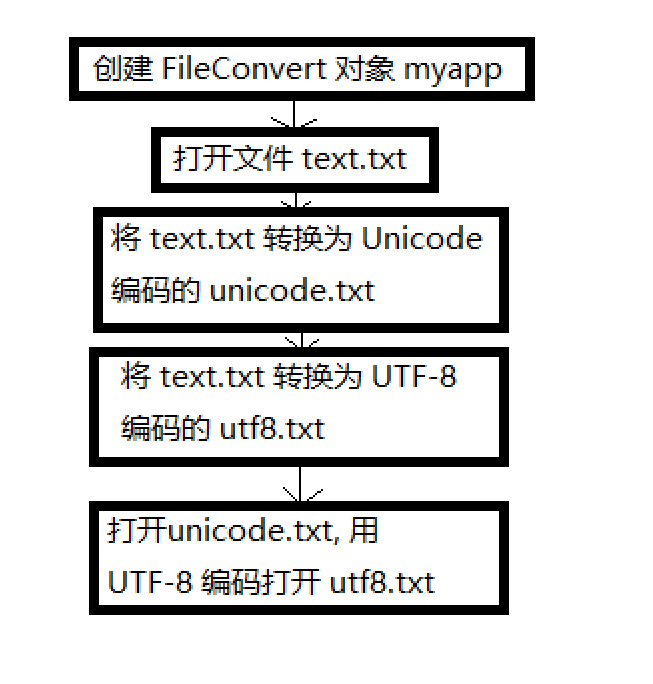
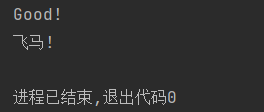
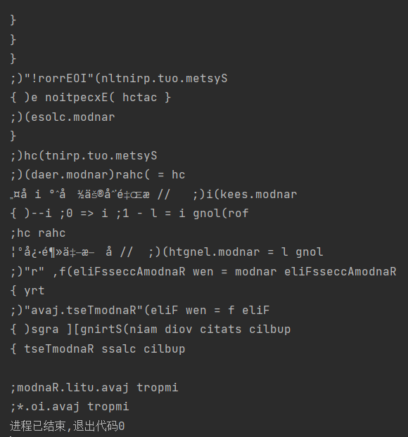

# 实验报告五
**任姗骊 320200932080**

## 第一部分
#### 3
* 流程图：
运行结果：
显示用 UTF-8 格式读取 utf8.txt 文件的内容。

修改 `myapp.readFile("unicode.txt");` : `myapp.readFile("unicode.txt", "Unicode");`
修改后运行结果：
源代码：
```java
import java.io.*;
public class FileConvert {
    public void readFile(String fileName) throws IOException {
        InputStream in = new FileInputStream(fileName);
        InputStreamReader reader;
    }

    // 从文件逐行读取字符串，charsetName 用于指定文件字符编码
    public void readFile(String fileName, String charsetName)throws IOException{
        InputStream in = new FileInputStream(fileName);
        InputStreamReader reader;
        if (charsetName == null)
            reader = new InputStreamReader(in);
        else
            reader = new InputStreamReader(in, charsetName);
        BufferedReader br = new BufferedReader (reader) ;
        String data;
        while((data = br. readLine()) != null)   //逐行读取数据
            System.out.println(data);
        br.close();
    }

    // 文件中的字符内容复制到另一个文件，并进行字符编码转换
    public void copyFile (String from, String charsetFrom, String to, String charsetTo ) throws IOException{
        InputStream in = new FileInputStream(from);
        InputStreamReader reader;
        if (charsetFrom == null)
         reader = new InputStreamReader(in);
        else
            reader = new InputStreamReader(in, charsetFrom);
        BufferedReader br = new BufferedReader(reader);
        OutputStream out = new FileOutputStream(to);
        OutputStreamWriter writer = new OutputStreamWriter (out, charsetTo);
        BufferedWriter bw = new BufferedWriter(writer);
        String data;
        while((data = br. readLine()) != null)
            bw. write(data+ "\n");
        br.close();
        bw.close();
    }

    public static void main(String args[])throws IOException{
        FileConvert myapp = new FileConvert();
        myapp.readFile("test.txt");
        myapp.copyFile("test.txt", null, "unicode.txt","Unicode");
        myapp.copyFile("test.txt",null,"utf8.txt", "UTF-8");
        myapp.readFile("unicode.txt");
        myapp. readFile("utf8.txt", "UTF-8");
    }
}
```
#### 4
`ObjectOutputStream` 类：把对象转成字节数据的输出到文件 objectFile.obj 中保存
`readObject()` 用来：读取之前保存的 static 变量
`class Student implements Serializable` 中 `Serializable` 的作用：将 Student 类序列化

运行结果：
源代码：
```java
import jdk.jfr.events.ExceptionThrownEvent;

import java. io. * ;
import java. util. * ;
public class ObjectSaver {
    public static void main(String[] args) throws Exception {
        ObjectOutputStream out = new ObjectOutputStream(new FileOutputStream("objectFile.obj"));
        String obj1 = "hello";
        Date obj2 = new Date();
        Student obj3 = new Student("张三", 20);
        out.writeObject(obj1);
        out.writeObject(obj2);
        out.writeObject(obj3);
        out.close();
        ObjectInputStream in = new ObjectInputStream(new FileInputStream("objectFile.obj"));
        String obj11 = (String) in.readObject();
        System.out.println("obj11: " + obj11);
        System.out.println("obj11 == obj1: " + (obj11 == obj1));
        System.out.println("obj11.equals(obj1): " + obj11.equals(obj1));
        Date obj22 = (Date) in.readObject();
        System.out.println("obj22: " + obj22);
        System.out.println("obj22 == obj2: " + (obj22 == obj2));
        System.out.println("obj22.equals(obj2): " + obj22.equals(obj2));
        Student obj33 = (Student) in.readObject();
        System.out.println("obj33: " + obj33);
        System.out.println("obj33 == obj3: " + (obj33 == obj3));
        System.out.println("obj33.equals(obj3): " + obj33.equals(obj3));
        in.close();
    }
}

class Student implements Serializable{
    private String name;
    private int age;
    public Student(String name, int age) {
        this.name = name;
        this.age = age;
        System.out.println("带两个参数的构造方法");
    }

    @Override
    public boolean equals(Object o) {
        if (this == o) return true;
        if (o == null || getClass() != o.getClass()) return false;
        Student student = (Student) o;
        return age == student.age && Objects.equals(name, student.name);
    }

    @Override
    public int hashCode() {
        return Objects.hash(name, age);
    }

    @Override
    public String toString() {
        return "Student{" +
                "name='" + name + '\'' +
                ", age=" + age +
                '}';
    }
}
```

## 第二部分
#### 2
运行结果：
源代码：
```java
import java.io.*;
import java.util.Random;

public class RandomTest {
    public static void main(String[] args) {
        File f = new File("RandomTest.java");
        try {
            RandomAccessFile random = new RandomAccessFile(f, "r");
            long l = random.length();  // 取文件长度
            char ch;
            for(long i = l - 1; i >= 0; i--) {
                random.seek(i);   // 指针定位到 i 处
                ch = (char)random.read();
                System.out.print(ch);
            }
            random.close();
        } catch (Exception e) {
            System.out.println("IOError!");
        }
    }
}
```

## 第三部分
#### 2
对实验2设计的矩阵类Matrix进行抽象设计，通过读取文本文件中的数据来创建或初始化矩阵数据，将矩阵加减运算的结果存入文件。
+ 运行结果：
+ 源代码：
```java
// Matrix.java
package Matrix;
public class Matrix{
    private int row;
    private int col;
    double [][]n = null;
    public Matrix(int a,int b){
        if(a > 0 && b > 0) {
            row = a;
            col = b;
            n = new double[row][col];
        }
        else{
             System.out.print("矩阵不成立！");
        }
          
    }

    public void setrow(int a){
        if(a > 0)
            row = a;
          else
             System.out.print("矩阵不成立！");
    }

    public int getrow(){
        return row;
    }

    public void setcol(int b){
         if(b>0)
              col = b;
         else
             System.out.print("矩阵不成立！");
    }

    public int getcol(){
        return col;
    }
    
    public void setnumber(int r,int c,double number){
        if(r <= row && c <= col)
            n[r-1][c-1] = number;
          else
             System.out.print("超出矩阵范围！");
    }

    public double getnumber(int r,int c){
        if(r > row || c > col) {
             System.out.print("超出矩阵范围！");
             System.exit(1);
        }
        return n[r-1][c-1];
    }

    public String toString() {
        String s = "";

        for(int i = 0; i < n.length; i++)
            for(int j = 0; j < n[i].length; j++) {
                s+=n[i][j];
                if(j < n[i].length)
                    s += " ";
                if(j == n[i].length-1)
                    s += "\n";
            }

        return s;
    }

    // 相加
    public Matrix plus(Matrix B) {
        if((row != B.row) || (col != B.col)){
            System.out.println("A不能与B运算");
            System.exit(1);
        }
        Matrix C = new Matrix(row,col);
        for(int i = 0; i < row; i++)
            for(int j = 0; j < col; j++)
                C.n[i][j] = n[i][j] + B.n[i][j];

        return C;
    }

    // 相减
    public Matrix sub(Matrix B) {
        if((row != B.row) || (col != B.col)){
            System.out.println("A不能与B运算");
            System.exit(1);
        }

        Matrix D = new Matrix(row,col);

        for(int i = 0; i < row; i++)
            for(int j=0; j < col; j++)
                D.n[i][j] = n[i][j] - B.n[i][j];

        return D;
    }

    // 判断相等
    public Boolean equals(Matrix B) {
        Boolean flag = true;
        if((row != B.row) || (col != B.col))
            flag = false;
        else
            for(int i = 0; i < row; i++)
                for(int j=0; j < col; j++)
                    if(n[i][j] != B.n[i][j])
                        flag = false;

        return flag;
    }
}

// Matrixtest.java
package Matrix;
import java.util.Scanner;
import java.util.Arrays;
import java.io.*;
public class Matrixtest {
    public static void main(String[] args) {
        try{
            String file = "file.txt";
            String file_result = "result.txt";
//            int a, b;
            BufferedReader x = new BufferedReader(new FileReader(file));
//            String l;
//            int z[];

            // 读取分割文件数据
            String l = x.readLine();
            int z[] = Arrays.asList(l.split(" ")).stream().mapToInt(Integer::parseInt).toArray();
            int a = z[0];   // 矩阵行
            int b = z[1];   // 矩阵列

            Matrix A = new Matrix(a,b);
            for(int i = 0; i < a; i++) {
                l = x.readLine();
                z = Arrays.asList(l.split(" ")).stream().mapToInt(Integer::parseInt).toArray();
                for(int j = 0; j < b; j++)
                    A.n[i][j] = z[j];
            }

//            int c,d;
            l = x.readLine();
            z = Arrays.asList(l.split(" ")).stream().mapToInt(Integer::parseInt).toArray();
            int c = z[0];
            int d = z[1];
            Matrix B = new Matrix(c,d);
            for(int i = 0; i < c; i++) {
                l = x.readLine();
                z = Arrays.asList(l.split(" ")).stream().mapToInt(Integer::parseInt).toArray();
                for(int j = 0; j < d; j++)
                    B.n[i][j] = z[j];
            }
            x.close();

            System.out.println("运算结果如下:");
            BufferedWriter y = new BufferedWriter(new FileWriter(file_result));

            //矩阵相加
            Matrix C = A.plus(B);
            System.out.println("A+B=\n"+C);
            y.write("A+B:"+"\n");
            y.write(C.toString());

            //矩阵相减
            Matrix D = A.sub(B);
            System.out.println("A-B=\n"+D);
            y.write("A-B:"+"\n");
            y.write(D.toString());
            y.close();

            //判断矩阵相等
            Boolean flag = A.equals(B);
            if(flag == true)
              System.out.println("矩阵相等");
            if(flag == false)
               System.out.println("矩阵不相等");

            //修改A的第1行，第1列的对应元素
            A.setnumber(1,1,50);

            //取出A的第1行，第1列的那个元素
            double nu = A.getnumber(1,1);
            System.out.println("A[0][0]="+nu);
            System.out.println("已写入文件！");
        } catch(IOException e) {
            System.out.println(e);
        }
    }
}
```

