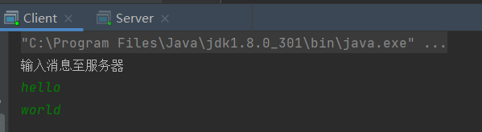
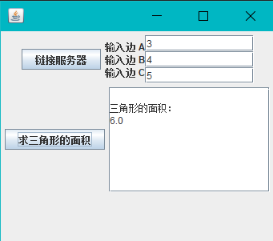

# 实验报告八
## 网络程序设计基础

**任姗骊 320200932080** 

## 第一部分
#### 1
+ 运行结果：


+ 源代码：
```java
// Client.java
import java.net.*;
import java.io.*;
public class Client {
  public static void main(String[] args) throws IOException {
    Socket soc = new Socket("target mechine", 4001);    // 将target mechine替换为目标计算机的IP地址或主机名
    BufferedReader br = new BufferedReader(new InputStreamReader(System.in));
    System.out.println("输入消息至服务器");
    String message = "";
    String temp;
    PrintStream ps = new PrintStream(soc.getOutputStream());
    while(!((temp = br.readLine()).equals("quit"))) {
      ps.println(temp);
    }
    ps.close();
    soc.close();
  }
}
```
```java
// Server.java
import java.net.*;
import java.io.*;
public class Server {
  public static void main(String[] args) throws IOException {
    ServerSocket ss = new ServerSocket(4001);
    Socket soc = ss.accept();
    BufferedReader br = new BufferedReader(
            new InputStreamReader(soc.getInputStream())
    );
    String message = "";
    String temp;
    do {
      temp = br.readLine();
      if(temp == null)  break;
      System.out.println("收到信息：" + temp);
      message = message + temp + "\n";
    } while (true);
    br.close();
    PrintStream ps = new PrintStream(new FileOutputStream("message.txt"));
    ps.println(message);
    ps.close();
    br.close();
    soc.close();
    System.out.println("已存储信息，请打开文件检查");
  }
}
```
#### 4
+ 在什么情况下需要使用编码转换：当输入输出的字符格式不一致时，或需要使用特定格式的编码时
+ 运行结果：
  
+ 源代码：
```java
import java.io.UnsupportedEncodingException;
import java.net.*;
public class EncodeTest {
    public static void main(String[] args) throws UnsupportedEncodingException {
        String str = "Jackson's bike - bell cost $5 中国";
        String str2 = URLEncoder.encode(str, "UTF-8");
        System.out.println(str);
        System.out.println(str2);
        String str3 = URLDecoder.decode(str2, "UTF-8");
        System.out.println(str3);
    }
}
```

## 第二部分
#### 2
+ 运行结果：
  
  
+ 源代码：
```java
// JsClient.java
package part2;
import java.io.*;
import java.net.*;  // 导入网络包
import java.awt.*;
import java.awt.event.*;
import javax.swing.*;
class JsClient extends JFrame implements Runnable, ActionListener {
  JButton connection, jsbutton;
  JTextField inputA, inputB, inputC;
  JTextArea showResult;
  Socket socket = null;    // 定义 Socket 引用
  DataInputStream in = null;
  DataOutputStream out = null;
  Thread thread;
  public JsClient() {
    socket = new Socket();
    connection = new JButton("链接服务器");
    jsbutton = new JButton("求三角形的面积");
    jsbutton.setEnabled(false);
    inputA = new JTextField("0", 12);
    inputB = new JTextField("0", 12);
    inputC = new JTextField("0", 12);

    Box boxV1 = Box.createVerticalBox();
    boxV1.add(new JLabel("输入边 A"));
    boxV1.add(new JLabel("输入边 B"));
    boxV1.add(new JLabel("输入边 C"));

    Box boxV2 = Box.createVerticalBox();
    boxV2.add(inputA);
    boxV2.add(inputB);
    boxV2.add(inputC);

    Box baseBox = Box.createHorizontalBox();
    baseBox.add(boxV1);
    baseBox.add(boxV2);
    Container con = getContentPane();
    con.setLayout(new FlowLayout());
    showResult = new JTextArea(8, 18);
    con.add(connection);
    con.add(baseBox);
    con.add(jsbutton);
    con.add(new JScrollPane(showResult));
    jsbutton.addActionListener(this);
    connection.addActionListener(this);
    thread = new Thread(this);
    setBounds(100, 100, 360, 310);
    setVisible(true);
    setDefaultCloseOperation(JFrame.EXIT_ON_CLOSE);
  }

  @Override
  public void actionPerformed(ActionEvent e) {
    if(e.getSource() == connection)
      try{
        if(socket.isConnected()) {}
        else {
          InetAddress address = InetAddress.getByName(null);   // IP 地址
          InetSocketAddress socketAddress = new InetSocketAddress(address, 4444); // 创建端口为 4444，地址为 address 的 socketAddress
          socket.connect(socketAddress);
          in = new DataInputStream(socket.getInputStream());     // socket 返回输入流
          out = new DataOutputStream(socket.getOutputStream());     // socket 返回输出流
          jsbutton.setEnabled(true);
          thread.start();
        }
      } catch (IOException ee) {}

    if(e.getSource() == jsbutton) {
      try {
        double a = Double.parseDouble(inputA.getText()),
                b = Double.parseDouble(inputB.getText()),
                c = Double.parseDouble(inputC.getText());
        if(a + b > c && a + c > b && b + c > a) {
          out.writeDouble(a);
          out.writeDouble(b);
          out.writeDouble(c);
        } else
          inputA.setText("你输入的 3 个数不构成三角形");
      } catch (Exception ex) {
        inputA.setText("请输入数字字符");
      }
    }
  }

  @Override
  public void run() {
    while (true) {
      try{
        double area = in.readDouble();   // in 读入一个 double 型数据
        showResult.append("\n三角形的面积：\n" + area);
        showResult.setCaretPosition((showResult.getText()).length());
      } catch (IOException e) {
        showResult.setText("与服务器已断开");
        jsbutton.setEnabled(false);
        break;
      }
    }
  }

  public static void main(String[] args) {
    JsClient win = new JsClient();
  }
}
```
```java
// JsServer.java
package part2;

import java.io.* ;
import java.net.* ;

public class JsServer{
  public static void main(String args[]) {
    ServerSocket server = null;
    ServerThread thread;
    Socket client = null;
    while(true) {
      try {
        server = new ServerSocket(4444);
      }catch(IOException e1) {
        System.out.println("正在监听");
      }
      try {
        client =server.accept();
        System.out.println("客户的地址:"+ client.getInetAddress());
      }catch (IOException е) {
        System.out.println("正在等待客户");
      }
      if(client!= null) {
        new ServerThread(client).start();
      }else{continue;}
    }
  }
}
class ServerThread extends Thread{
  Socket socket;
  DataOutputStream out = null;
  DataInputStream in= null;
  String s= null;
  ServerThread(Socket t){
    socket=t;
    try {
      in = new DataInputStream(socket.getInputStream());
      out = new DataOutputStream(socket.getOutputStream());
    }
    catch (IOException e) {}
  }
  public void run() {
    while(true) {
      double a=0,b=0,c=0,area=0;
      try {
        a = in.readDouble();
        b = in.readDouble();
        c = in.readDouble();
        double p=(a+b+c)/2.0;
        area=Math.sqrt(p*(p-a)*(p- b)*(p-c));
        out.writeDouble(area);
      }catch (IOException e) {
        System.out.println("客户离开");
        break; }
    }
  }
}
```

## 第三部分
+ 设计一个基于 TCP 的聊天小程序
+ 运行结果:
  
  
+ 设计思路：服务器和客户端两者都需要接收发送信息。两者都建立各自的 socket，利用 InputStream 和 OutputStream 读取发送信息。work() 专门处理输出输入的数据，添加 while 循环来保证持续童话。
+ 源代码：
```java
// Server.java
package part3;

import java.io.*;
import java.net.*;
import java.util.Scanner;
import java.util.concurrent.Executor;
import java.util.concurrent.ExecutorService;


public class Server {
  private ServerSocket serverSocket;
  private static Socket socket;

  public Server() throws IOException {
    serverSocket = new ServerSocket(8088);
    System.out.println("等待客户端连接");
    socket = serverSocket.accept();  // 监听
    System.out.println(socket.getInetAddress() + "客户端已连接"); // 客户ip
    work(socket);
  }

  // 服务器任务 读取客户端发送过来的数据
  public void work(Socket socket) throws IOException {
    InputStreamReader isr = null;
    OutputStreamWriter osw = null;
    Scanner scanner = new Scanner(System.in);
    try {
      InputStream is = socket.getInputStream();
      isr = new InputStreamReader(is, "utf8");
      char[] arr = new char[1024];
      while(true) {
        int len = isr.read(arr);
        String message = new String(arr, 0, len);
        System.out.println(socket.getInetAddress() + ": " + message);

        // 服务器数据发回
        OutputStream os = socket.getOutputStream();
        osw = new OutputStreamWriter(os, "utf8");
        String messageToClient = scanner.next();
        osw.write(messageToClient);
        osw.flush();
      }
    } catch (IOException e) {
      e.printStackTrace();
    } finally {
      osw.close();
      isr.close();
    }
  }

  public static void main(String[] args) throws IOException {
    new Server();
  }
}
```
```java
// Client.java
package part3;
        import java.io.*;
        import java.net.*;
        import java.util.Scanner;

public class Client {
  private Socket socket;

  public Client() throws IOException {
    socket = new Socket("localhost", 8088);
    work(socket);
  }

  // 客户端任务
  public static void work(Socket socket) throws IOException {
    OutputStreamWriter osw = null;
    InputStreamReader isr = null;

    try {
      Scanner scanner = new Scanner(System.in);
      OutputStream os = socket.getOutputStream();
      InputStream is = socket.getInputStream();

      // 向服务器发送信息
      osw = new OutputStreamWriter(os, "utf8");

      while(true) {
        String messageOut = scanner.next();
        osw.write(messageOut);
        osw.flush();

        // 接收从服务器传入的信息
        isr = new InputStreamReader(is, "utf8");
        char[] arr = new char[1024];
        int len = isr.read(arr);
        String message = new String(arr, 0, len);
        System.out.println("服务器:" + message);
      }
    } catch (IOException e) {
      e.printStackTrace();
    } finally {
      isr.close();
      osw.close();
    }
  }

  public static void main(String[] args) throws IOException {
    new Client();
  }
}
```