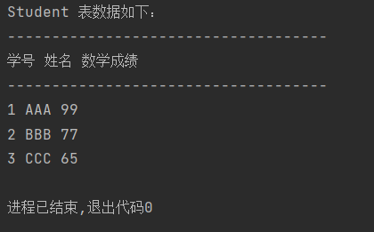
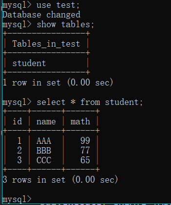
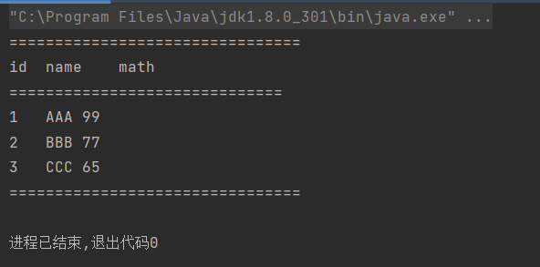
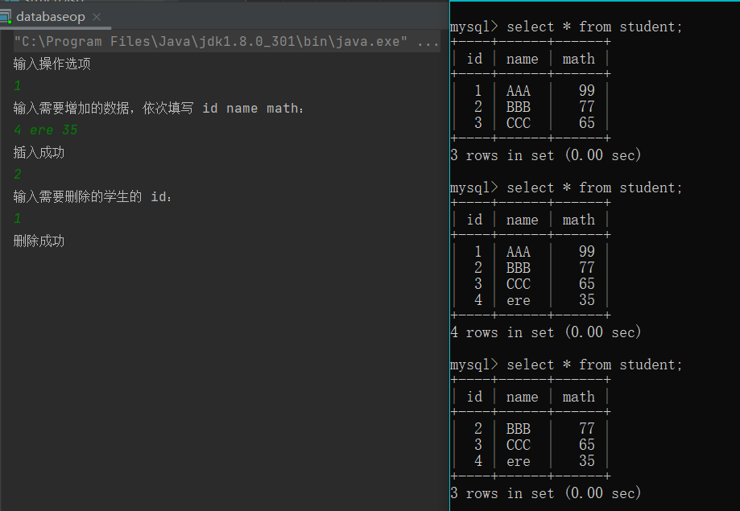
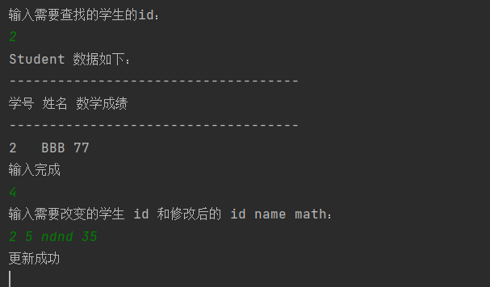
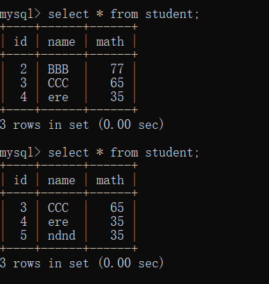

# 实验报告八 
## 数据库程序设计
**任姗骊 320200932080**

## 第一部分
#### 2
+ 运行结果


+ 源代码：
```java
import java.sql.*;
public class ConnectToMySQL {
    public static Connection getConnection() throws ClassNotFoundException, SQLException {
        String url = "jdbc:mysql://localhost:3306/test";
        Class.forName("com.mysql.cj.jdbc.Driver");
        String userName = "root";
        String password = "12345678q";
        Connection con = DriverManager.getConnection(url, userName, password);
        return con;
    }

    public static void main(String[] args) {
        try {
            Connection con = getConnection();
            Statement sql = con.createStatement();
            sql.execute("DROP TABLE IF EXISTS student");
            sql.execute("CREATE TABLE student(" +
                    "id INT NOT NULL AUTO_INCREMENT," +
                    "name VARCHAR(20) NOT NULL default 'name'," +
                    "math INT not null default 60," +
                    "PRIMARY KEY(id))");
            sql.execute("INSERT student VALUES(1, 'AAA', '99')");
            sql.execute("INSERT student VALUES(2, 'BBB', '77')");
            sql.execute("INSERT student VALUES(3, 'CCC', '65')");
            String query = "SELECT * FROM student";
            ResultSet result = sql.executeQuery(query);
            System.out.println("Student 表数据如下：");
            System.out.println("------------------------------------");
            System.out.println("学号" + " " + "姓名" + " " + "数学成绩");
            System.out.println("------------------------------------");
            int number;
            String name;
            String math;
            while(result.next()) {
                number = result.getInt("id");
                name = result.getString("name");
                math = result.getString("math");
                System.out.println(number + " " + name + " " + math);
            }
            sql.close();
            con.close();
        } catch (SQLException ex) {
            System.err.println("SQLException:" + ex.getMessage());
        } catch (java.lang.ClassNotFoundException ex) {
            System.out.println("SQLException:" + ex.getMessage());
        }
    }
}
```
## 第二部分
+ 运行结果：

+ 源代码：
```java
import java.io.*;
import java.sql.*;

public class StructDisp {
    static String colLabel[];
    static int colCount;

    public static void main(String[] args){
        try {
            Class.forName("com.mysql.cj.jdbc.Driver");
        } catch (ClassNotFoundException e) {
            System.out.println(e.getMessage());
        }
        try{
            Connection con = DriverManager.getConnection("jdbc:mysql://localhost:3306/test", "root", "12345678q");
            Statement stmt = con.createStatement();     // 创建语句对象
            boolean status = stmt.execute("SELECT * FROM student");
            ResultSet rs = stmt.getResultSet();
            showStruct(rs);
            showData(rs);
            stmt.close();
            con.close();    // 关闭链接
        } catch (SQLException e) {
            System.out.println(e.getSQLState());
        }
    }

    private static void showData(ResultSet rs) throws SQLException {
        if(rs != null) {
            while(rs.next()) {   // 遍历记录集
                System.out.print("" + rs.getString(colLabel[1]));
                System.out.print("\t" + rs.getString(colLabel[2]));
                System.out.print("\t" + rs.getInt(colLabel[3]) + "\n");
            }
        }
        System.out.println("================================");
    }

    public static void showStruct(ResultSet rs) throws SQLException {
        ResultSetMetaData md = rs.getMetaData();
        colCount = md.getColumnCount();
        colLabel = new String[colCount + 1];
        System.out.println("================================");
        for(int i = 1; i <= colCount; i++) {
            colLabel[i] = md.getColumnLabel(i);
            System.out.print("" + colLabel[i] + "\t");
        }
        System.out.println("\n==============================");
    }
}
```
## 第三部分
+ 运行结果：
  
  
  
+ 设计思路：先输入需要操作的类型数，根据这个数字进行响应操作。
+ 源代码；
```java
package mysql;

import java.io.*;
import java.sql.*;
import java.util.Scanner;

public class databaseop {
    public static Connection getConnection() throws ClassNotFoundException, SQLException {
        String url = "jdbc:mysql://localhost:3306/test";
        Class.forName("com.mysql.cj.jdbc.Driver");      // 加载驱动
        String userName = "root";
        String password = "12345678q";
        Connection con = DriverManager.getConnection(url, userName, password);
        return con;
    }

    public static void main(String[] args) {
        try {
            Connection con = getConnection();
            Statement sql = con.createStatement();

            // 初始化
            sql.execute("DROP TABLE IF EXISTS student");
            sql.execute("CREATE TABLE student(" +
                    "id INT NOT NULL AUTO_INCREMENT," +
                    "name VARCHAR(20) NOT NULL default 'name'," +
                    "math INT not null default 60," +
                    "PRIMARY KEY(id))");
            sql.execute("INSERT student VALUES(1, 'AAA', '99')");
            sql.execute("INSERT student VALUES(2, 'BBB', '77')");
            sql.execute("INSERT student VALUES(3, 'CCC', '65')");

            System.out.println("输入操作选项");
            Scanner scanner = new Scanner(System.in);
            int id = 0;
            int math;
            String name;
            String op = scanner.next();
            switch (op) {
                case "1":       // 插入信息
                    System.out.println("输入需要增加的数据，依次填写 id name math：");
                    id = scanner.nextInt();
                    name = scanner.next();
                    math = scanner.nextInt();
                    insert(id, name, math);
                    break;
                case "2":       // 删除信息
                    System.out.println("输入需要删除的学生的 id：");
                    id = scanner.nextInt();
                    delete(id);
                    break;
                case "3":       // 查找信息
                    System.out.println("输入需要查找的学生的id：");
                    id = scanner.nextInt();
                    select(id);
                    break;
                case "4":
                    System.out.println("输入需要改变的学生 id 和修改后的 id name math：");
                    int idp = scanner.nextInt();
                    id = scanner.nextInt();
                    name = scanner.next();
                    math = scanner.nextInt();
                    update(idp, id, name, math);
                    break;
                default:
                    System.out.println("输入不正确");
                    break;
            }
            sql.close();
            con.close();
        } catch (SQLException ex) {
            System.err.println("SQLException:" + ex.getMessage());
        } catch (java.lang.ClassNotFoundException ex) {
            System.out.println("SQLException:" + ex.getMessage());
        }
    }

    private static void update(int idp, int id, String name, int math) throws SQLException, ClassNotFoundException {
        String query = "UPDATE student SET id = ?, name = ?, math = ? WHERE id = ? ";
        Connection con = getConnection();
        Statement sql = con.createStatement();
        PreparedStatement pst = con.prepareStatement(query);
        pst.setInt(1, id);
        pst.setString(2, name);
        pst.setInt(3, math);
        pst.setInt(4, idp);
        pst.executeUpdate();
        System.out.println("更新成功");

        con.close();
        pst.close();
    }

    private static void delete(int id) throws SQLException, ClassNotFoundException {
        String query = "DELETE FROM student WHERE id = ?";
        Connection con = getConnection();
        Statement sql = con.createStatement();
        PreparedStatement pst = con.prepareStatement(query);
        pst.setInt(1, id);
        pst.executeUpdate();
        System.out.println("删除成功");

        con.close();
        pst.close();
    }

    private static void insert(int id, String name, int math) throws SQLException, ClassNotFoundException {
        String query = "INSERT INTO student (id, name, math) VALUES(?, ?, ?)";
        Connection con = getConnection();
        Statement sql = con.createStatement();
        PreparedStatement pst = con.prepareStatement(query);
        pst.setInt(1, id);
        pst.setString(2, name);
        pst.setInt(3, math);
        pst.executeUpdate();
        System.out.println("插入成功");

        con.close();
        pst.close();
    }

    private static void select(int id) throws SQLException, ClassNotFoundException {
        String query = "SELECT * FROM student WHERE id = ?";
        Connection con = getConnection();
        Statement sql = con.createStatement();
        PreparedStatement pst = con.prepareStatement(query);
        pst.setInt(1, id);
        ResultSet rs = pst.executeQuery();

        System.out.println("Student 数据如下：");
        System.out.println("------------------------------------");
        System.out.println("学号" + " " + "姓名" + " " + "数学成绩");
        System.out.println("------------------------------------");
        int number;
        String name;
        String math;
        if(rs != null) {
            rs.next();
            number = rs.getInt("id");
            name = rs.getString("name");
            math = rs.getString("math");
            System.out.println(number + "   " + name + " " + math + "\n输入完成");
        }
        else {
            System.out.println("没有这个学生");
        }
        con.close();
        pst.close();
    }
}
```
