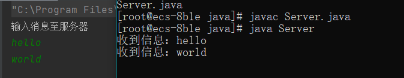
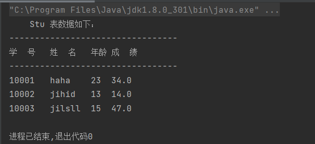

# 实验九
## Java 基础程序在鲲鹏平台下的编译和运行
**任姗骊 320200932080**

## 一 完成网络编程程序移植
+ 运行结果:

+ 源代码：
```java
// Client.java
import java.net.*;
import java.io.*;
public class Client {
    public static void main(String[] args) throws IOException {
        Socket soc = new Socket("139.9.235.192", 3389);    // 将target mechine替换为目标计算机的IP地址或主机名
        BufferedReader br = new BufferedReader(new InputStreamReader(System.in));
        System.out.println("输入消息至服务器");
        String message = "";
        String temp;
        PrintStream ps = new PrintStream(soc.getOutputStream());
        while(!((temp = br.readLine()).equals("quit"))) {
            ps.println(temp);
        }
        ps.close();
        soc.close();
    }
}
```
```java
import java.net.*;
import java.io.*;
public class Server {
    public static void main(String[] args) throws IOException {
        ServerSocket ss = new ServerSocket(3389);
        Socket soc = ss.accept();
        BufferedReader br = new BufferedReader(
                new InputStreamReader(soc.getInputStream())
        );
        String message = "";
        String temp;
        do {
            temp = br.readLine();
            if(temp == null)  break;
            System.out.println("收到信息：" + temp);
            message = message + temp + "\n";
        } while (true);
        br.close();
        PrintStream ps = new PrintStream(new FileOutputStream("message.txt"));
        ps.println(message);
        ps.close();
        br.close();
        soc.close();
        System.out.println("已存储信息，请打开文件检查");
    }
}
```

## 二 远程连接数据库进行测试运行
+ 运行结果：

+ 源代码：
```java
import java.sql.*;
public class ConnectToMySQL {
    public static Connection getConnection() throws SQLException, ClassNotFoundException {
        String url = "jdbc:mysql://116.63.159.135:3306/lzu2021students";
        Class.forName("com.mysql.cj.jdbc.Driver");
        String username = "root";
        String password = "12345678qQ";
        Connection con = DriverManager.getConnection(url, username, password);
        return con;
    }

    public static void main(String[] args) {
        try {
            Connection con = getConnection();
            Statement sql = con.createStatement();
            String querystatement = "SELECT * FROM stu";
            ResultSet result = sql.executeQuery(querystatement);

            System.out.println("\tStu 表数据如下：");
            System.out.println("---------------------------------");
            System.out.println("学  号\t" + "姓  名\t" + "年龄\t" + "成  绩");
            System.out.println("---------------------------------");
            String stu_id;
            String stu_name;
            int stu_age;
            float stu_score;

            while (result.next()) {
                stu_id = result.getString("Stu_id");
                stu_name = result.getString("Stu_name");
                stu_age = result.getInt("Stu_age");
                stu_score = result.getFloat("Stu-score");
                System.out.println(stu_id + "\t" + stu_name + "\t" + stu_age + "\t" + stu_score);
            }
            sql.close();
            con.close();
        } catch (ClassNotFoundException e) {
            System.err.println("ClassNotFoundException: " + e.getMessage());
        } catch (SQLException ex) {
            System.err.println("SQLException: " + ex.getMessage());
        }
    }
}
```
